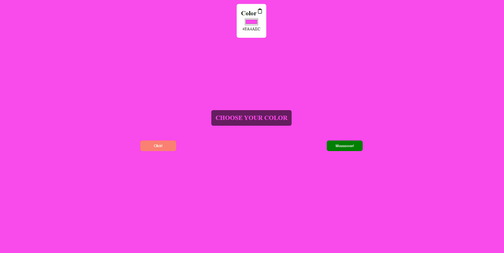

# Random Bg Color

  

## About the Project

A simple web page that allows you to generate random background colors. You can click a button or hover over another button to change the background color randomly.

## Technologies Used
- HTML
- CSS
- JavaScript
- Font Awesome for icons

## Features
- Change the background color by clicking a button or hovering over another button.
- Display the generated color in both hexadecimal and RGB formats.
- Copy the color code to the clipboard by clicking on the copy icon.

## Project Structure
- `index.html`: Main HTML file containing the structure of the webpage.
- `style.css`: CSS file containing styles for the webpage.
- `app.js`: JavaScript file containing the logic for generating random colors.

## Usage
- Click the "Click!" button or hover over the "Mouseover!" button to change the background color.
- The color code is displayed in both hexadecimal and RGB formats.
- You can also copy the color code to the clipboard by clicking on the copy icon.